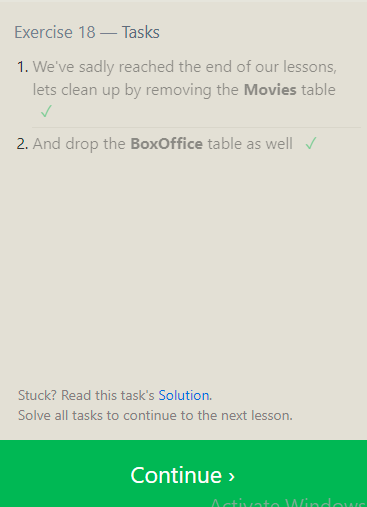

 # Reading Notes 

 This site helps document and highlight new knowledge gained during the ***software development course***.

### Code 102 - Intro to Software Development
### Code 201 - Foundations of Software Development
### Code 301 - Intermediate Software Development
### Code 401 - Advanced Software Development

Relational Database

## Relational Database & SQL

<b>A relational database</b> is a database organized according to the relational model of data. It can helps us to cut down on duplicated data and provides a much more useful data structure for us to interact with.

<b>SQL</b> which stands for Structured Query Language,is a programming language that is used by most relational database management systems (RDBMS) to manage data stored in tables.
It is particularly helpful because it can:

- Execute queries against a database.
- Retrieve data from a database.
- Insert records into a database.
- Update records in a database.
- Delete records from a database.
- Create new databases, or new tables in a database.

