 # Reading Notes 

 This site helps document and highlight new knowledge gained during the ***software development course***.

### Code 102 - Intro to Software Development
### Code 201 - Foundations of Software Development
### Code 301 - Intermediate Software Development
### Code 401 - Advanced Software Development

<b>Relational Database</b>

## Relational Database & SQL

<b>A relational database</b> is a database organized according to the relational model of data. It can helps us to cut down on duplicated data and provides a much more useful data structure for us to interact with.

<b>SQL</b> which stands for Structured Query Language,is a programming language that is used by most relational database management systems (RDBMS) to manage data stored in tables.
It is particularly helpful because it can:

- Execute queries against a database.
- Retrieve data from a database.
- Insert records into a database.
- Update records in a database.
- Delete records from a database.
- Create new databases, or new tables in a database.

This is the images related to sql tasks in [ SQL Bolt](https://sqlbolt.com/)

| Images [1-6] | Images [13-18] |
| ------------- | ------------- |
| 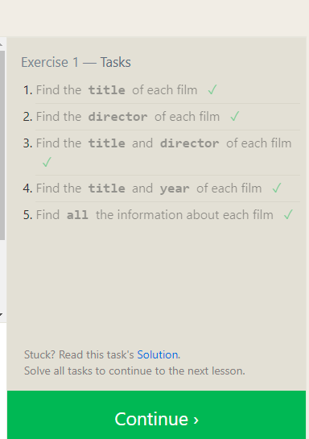  | 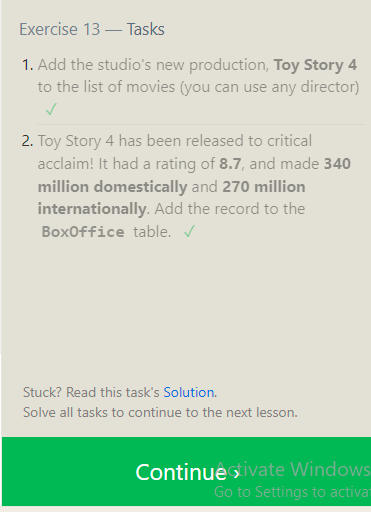  |
| 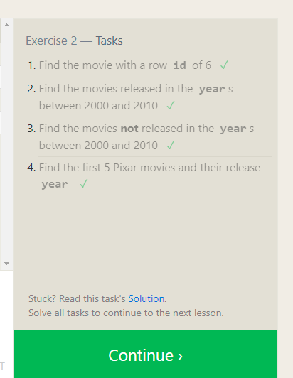  | 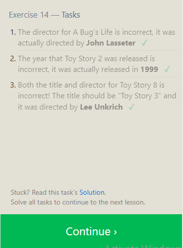  |
| 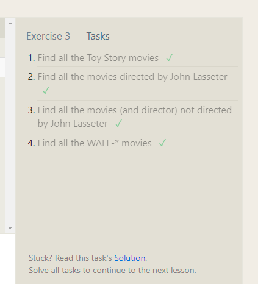  | 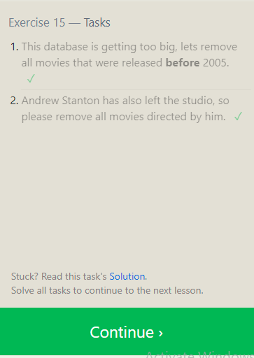 |
| 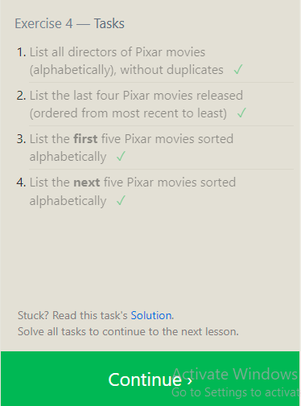 |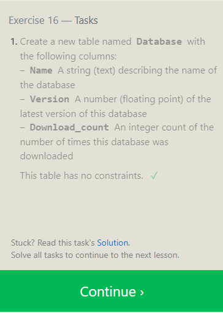 |
|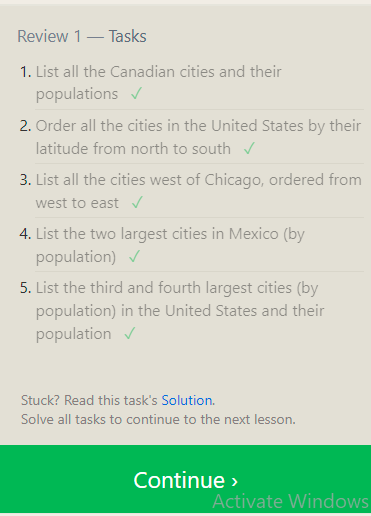 |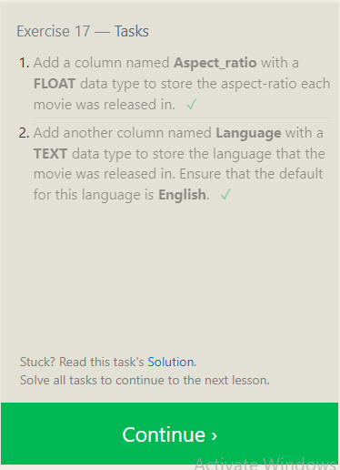 |
| 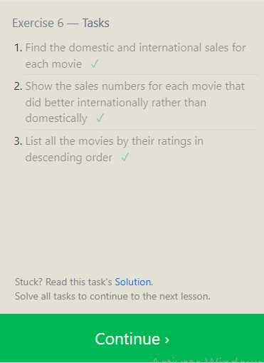  | |

 <b>Linux Command line</b>

From [ Bash Command Line Tutorials](https://ryanstutorials.net/linuxtutorial/),I covered the basics of working with the Linux command line, to get the computer to do useful work, without using the graphical user interface; windows and buttons, and I will summraize some of these powerful commands: 

- In the first, I learned the **basic Navigation commands**, that helps in navigating around the Linux file system, So we can use the **pwd** (Print Working Directory) command to see where we are. and from our current location, we can move anywhere else with the **cd** (Change Directory) command, also there is **ls** (List Files) command to perform a listing of the given path or our current directory.
- Also I learnead how create a directory structure, and Actualy its the first step we need to do, because it will help us organise the data in a manageable way, and we can create it by typing  **mkdir 'directory-name'** command which is short for Make Directory.
In Addition to that there is a alot of commands to manipulation files, ex: 
**rmdir 'directory name'**, to remove a directory (only if empty). 
**touch 'file name'**, to create a blank file.
**rm 'path'**, remove a file or directory. 
- The manual pages are a set of pages that explain every command available on our system including what they do, By typing **man 'command'** we will get access to a description of what the command does, as well as a list of all possible options and what they do.
-  And we can managing all the processes that running on our machine with the following command: **ps aux**

